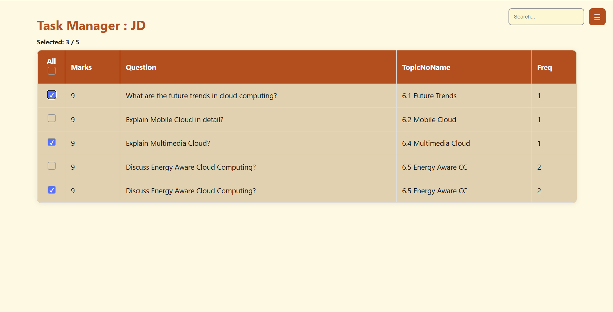
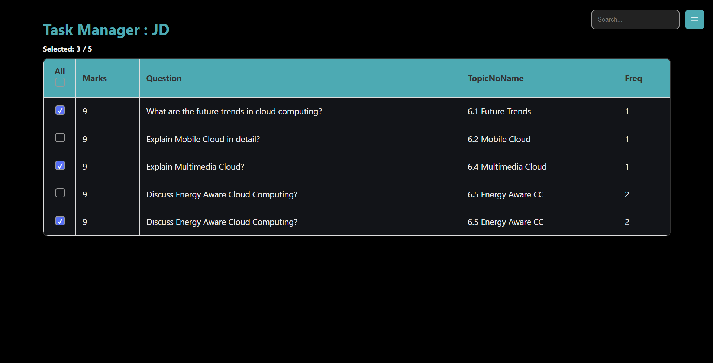
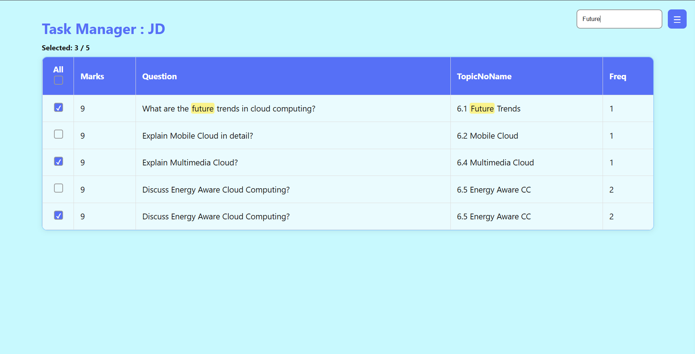
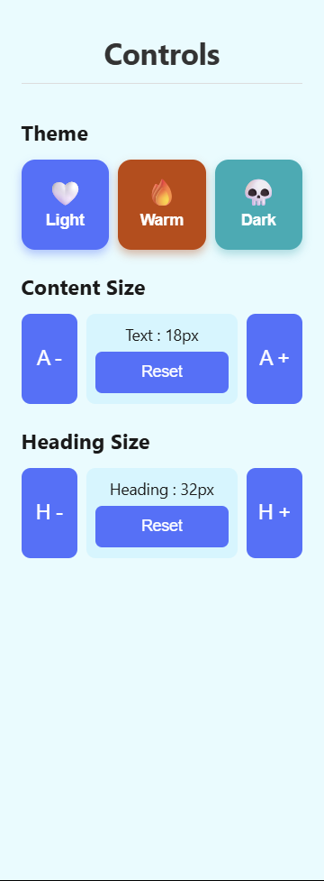

# 🗂️ Task Manager UI

A modern and responsive Task Manager local web interface built with HTML, CSS, and JavaScript, showcasing dynamic UI features including theme switching, responsive layout, search capability, and interactive navigation.

---

## 🔥 Features

- 😁 **Make Life Easy**
  - Easy to use.
  - Easy to manage multiple task.

- 📑 **Task Display Panel**
  - Clean layout with tasks shown in a tabular or card view.
  - Highlights priority, due date, and category.

- 📑 **Customizable**
  - Increase/Decrease Content size (for ease of Eye).
  - Increase/Decrease Headings size (for ease of Eye).

- 🔍 **Search Functionality**
  - Instantly filter tasks using the integrated search bar.
  - Case-insensitive and real-time filtering as you type.

- 📍 **Slider Sidebar Navigation**
  - Collapsible navigation with smooth animations.
  - Access different sections like Dashboard, Projects, Today, etc.

- 🎨 **Theme Support**
  - Switch between light and dark modes.
  - All elements, including the slider navbar, adapt to the selected theme.

---

## 🖼️ UI Snapshots

<div style="display: flex; overflow-x: auto; gap: 20px; padding: 10px 0;">

  <div style="min-width: 300px; text-align: center;">
    
    <p>🤍 Light Mode</p>
  </div>

  <div style="min-width: 300px; text-align: center;">
    
    <p>🔥 Warm Mode</p>
  </div>

  <div style="min-width: 300px; text-align: center;">
    
    <p>💀 Dark Mode</p>
  </div>

</div>

### 🔍 Search in Action


### 🎛️ Slider Controls


---

## 🛠️ Tech Stack

- HTML5
- CSS3 (Custom styling + transitions)
- JavaScript (DOM manipulation, event handling)
- localStorage (Persist Data)

---

## 🚀 Getting Started

1. Clone the repository:
   ```bash
   git clone https://github.com/Jaidatt007/Task_Manager.git
   cd Task_Manager
   ```

2. Open `TaskManager.html` in your browser:
   ```bash
   start TaskManager.html
   ```

---

## 📁 Folder Structure

```
📦 Task_Manager/
 ┣ 📂 snapshots/
 ┃ ┣ 📄 theme_light.png
 ┃ ┣ 📄 theme_warm.png
 ┃ ┣ 📄 theme_dark.png
 ┃ ┗ 📄 slider_controls.png
 ┣ 📄 TaskManager.html
```

---

## 📌 To Do

- [ ] Add task.
- [ ] Enable localStorage for task persistence.
- [ ] Add animations on theme switch and sidebar toggle.

---

## 🧑‍💻 Author

**Jaidatt Kale**  
📧 jaidattkale555@example.com
🔗 [GitHub](https://github.com/Jaidatt007)
🔗 [LinkedIn](https://www.linkedin.com/in/jaidattkale/)

---

## 📜 License

This project is licensed under the MIT License.
